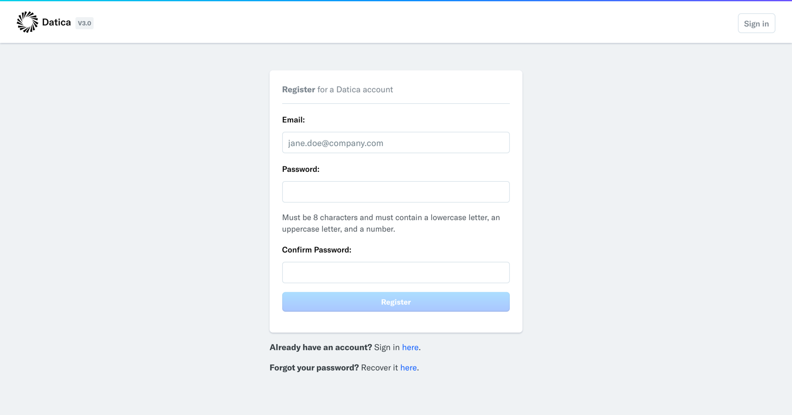

# Create a Datica Account via the Compliant Cloud Dashboard

Before you can accept an invitation to an organization and gain access to any environments, you need to create a [Compliant Cloud Dashboard](https://product.datica.com/compliant-cloud) account!

If you already have an account, continue on to the next step.

# Receive an Invitation from an Organization Admin or Owner

An organization admin or owner must invite you to the organization. Instructions for sending invites are in the [Organizations article](/compliant-cloud/articles/concepts/organizations)

# Accept Invitation

Once invited, you will receive an email that looks like this:

The email contains two options for accepting the invitation:

## Option 1: Sign In to Dashboard and Click Link

Navigate to the [Compliant Cloud Dashboard](https://product.datica.com/compliant-cloud) and sign in.

Then, click the link in the email to accept the invitation.

## Option 2: Accept via CLI with Code from E-mail

Copy and paste the CLI command from the e-mail into your terminal window:

`datica invites accept your-invite-code-here`

### See also:

* [Organizations](/compliant-cloud/articles/concepts/organizations)
