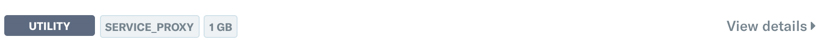
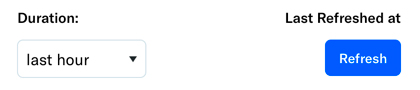
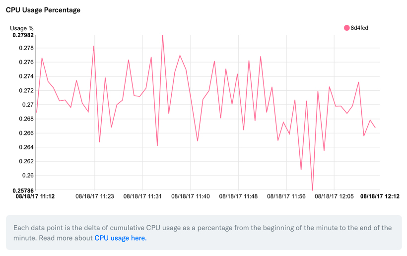
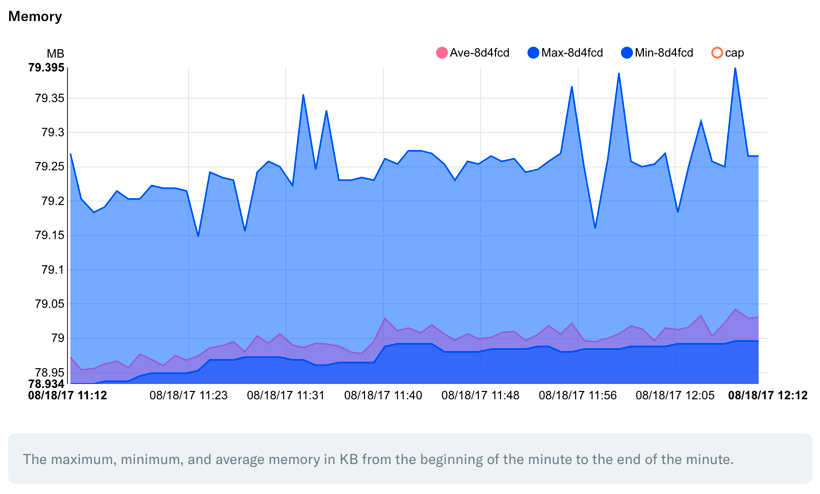

# Platform Metrics
# The Platform Environment Metrics
the Platform Dashboard includes comprehensive metrics for your environment's services.

## Viewing Metrics in the Platform Dashboard

Each service in the Platform Dashboard contains individual graphs of metrics.

Click on the "Details" button for a service to examine them.

### Duration and Refresh
By default, the Platform Dashboard shows the last hour of metrics for the selected service. You can change the display window by selecting a different option from the dropdown located immediately above the metric graphs.

You can also refresh the existing time intervals by clicking the "Refresh" button.

## Metrics Collected
Below are brief explanations of the metrics collected.

### CPU Usage
CPU Usage is tracked as a percentage of the amount of CPU the service has been allotted.

### Memory
Memory usage is tracked in terms of the number of megabytes of RAM used by the container. The memory limit of the container is clearly displayed by a red line across the top of the graph should your container approach that limit.

The minimum, maximum, and average memory use is also displayed.

### Network In/Out

Network usage is tracked by total packets and total bandwidth, for both inbound and outbound traffic.

