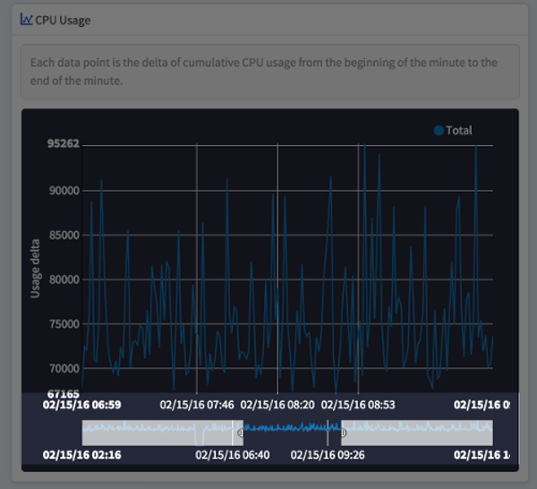
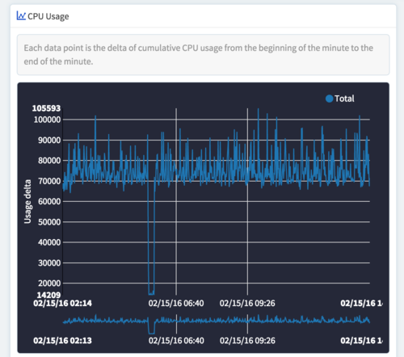
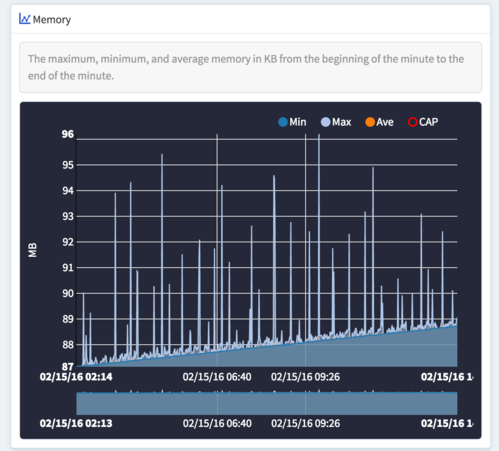
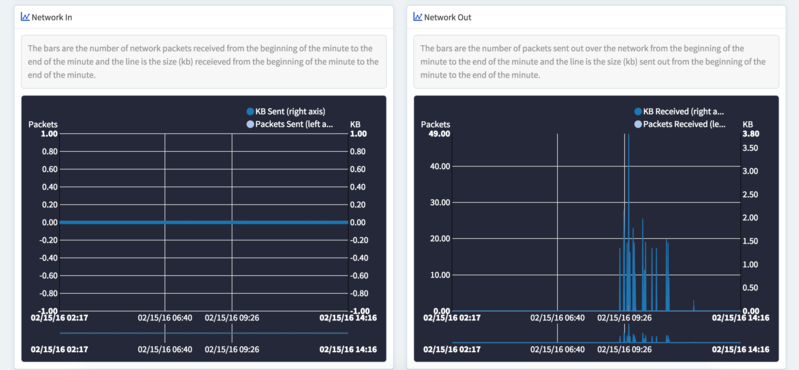

# Stratum Environment Metrics
The Stratum Dashboard includes comprehensive metrics for your environment's services.

## Viewing Metrics in the Stratum Dashboard

Each service in the Stratum Dashboard contains individual graphs of metrics.

Click on the "Details" button for a service to examine them.

### Duration and Refresh
By default, the Stratum Dashboard shows the last hour of metrics for the selected service. You can change the display window by selecting a different option from the dropdown located immediately above the metric graphs.

You can also refresh the existing time intervals by clicking the "Refresh" button.

### Interval Focus
With each graph, you can focus in greater detail on specific lengths of time. Underneath each main graph is a focus graph. On this smaller graph, you can highlight a length of time to focus the main graph on that interval. Below is an example of how the main graph shifts to display the selected interval.

## Metrics Collected
Below are brief explanations of the metrics collected.

### CPU Usage
The metrics collected here do not correspond to a specific measurement of cycles consumed per second. This metric is best used to examine relative differences in CPU usage over time. Using the time based data to compare usage to log events would be one example of how to use the CPU usage data.

### Memory
Memory usage is tracked in terms of the number of megabytes of RAM used by the container. The memory limit of the container is clearly displayed by a red line across the top of the graph should your container approach that limit.

The minimum, maximum, and average memory use is also displayed.

### Network In/Out

Network usage is tracked by total packets and total bandwidth, for both inbound and outbound traffic.

