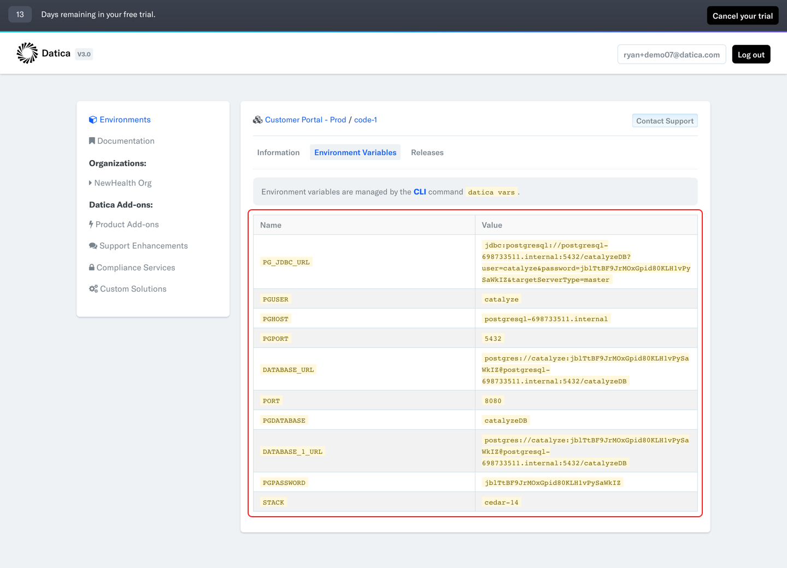

# The Platform Variables

## How do Variables Work?
Variables in The Platform are set or reset for a code service every time the service is ***built*** or ***redeployed***. These variables contain data that the code service can then consume as environment variables during operation. Variables are specific to a single code service.

## Why Are Variables Important?
Variables in The Platform allow an application to consume information that is not appropriate for storing in a code repository. That type of data could include:

* Third-Party Service Credentials
* Dynamic Configuration Settings

## Pre-Defined Variables
Each new code service comes with several pre-defined variables that contain important information for your application to function and vary depending on the services in your environment. You can view these in the [The Platform Dashboard][https://product.datica.com/compliant-cloud] on your code service as soon as your environment is created by Datica. Examples include:

* DATABASE_URL
* S3_BUCKET
* REDIS_URL

Before you make your first code deploy, make sure that your application is ready to consume these values! First, click on the "View Details" link for the code service.

The service's variables are located here:

## Setting Your Own Variables
To set your own variables checkout our variable management guide located [here](/compliant-cloud/articles/environment-variables-manage/).