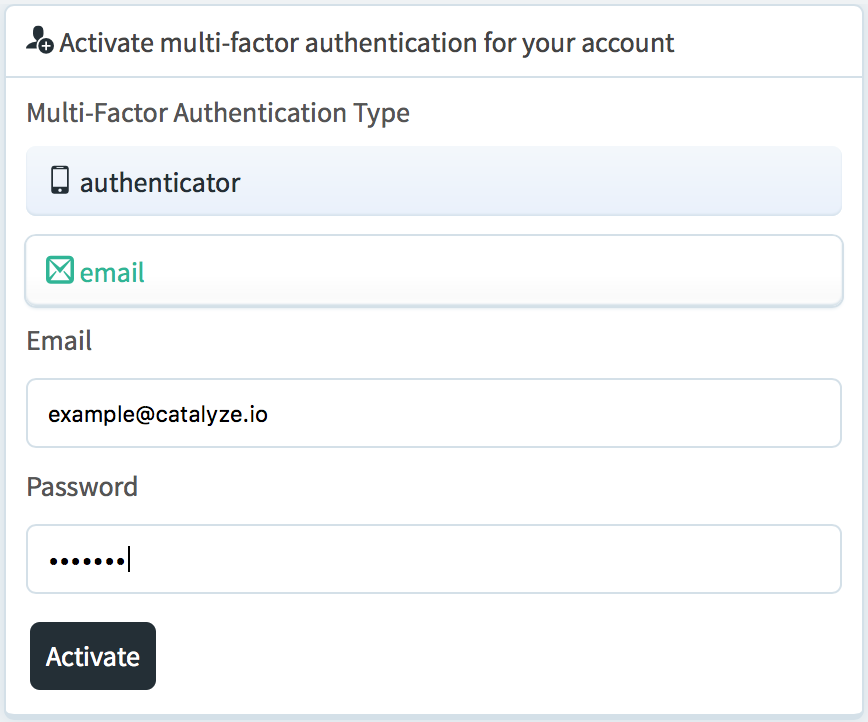
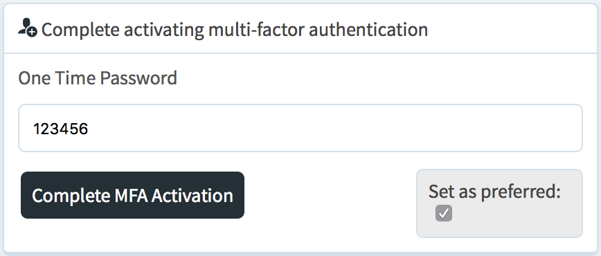
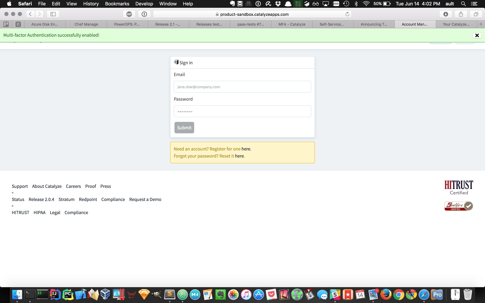
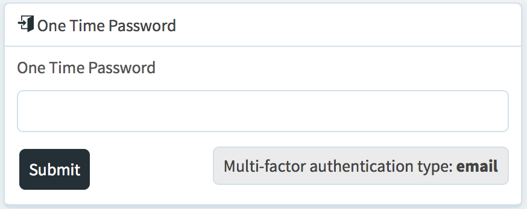
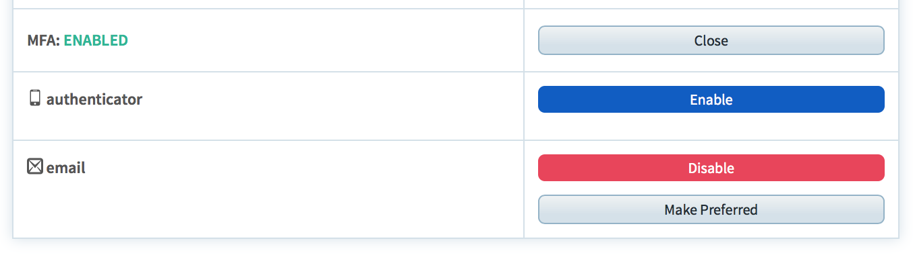
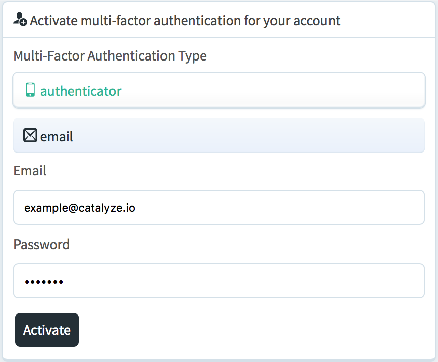
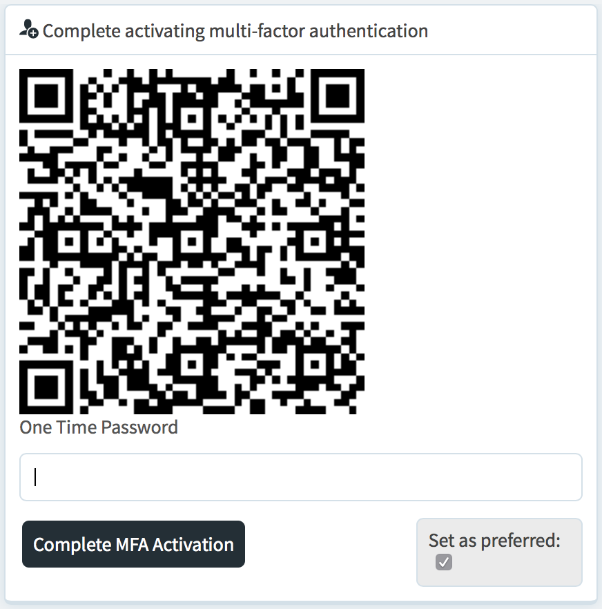
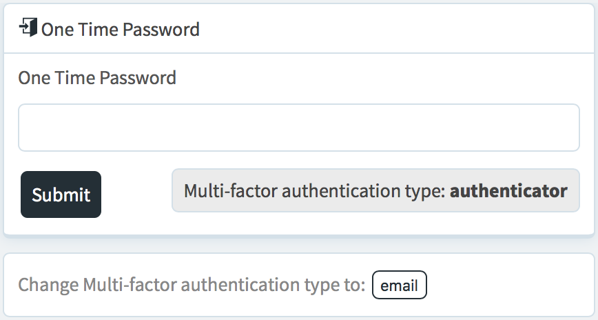
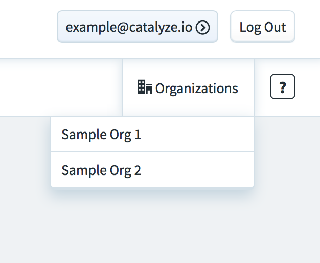
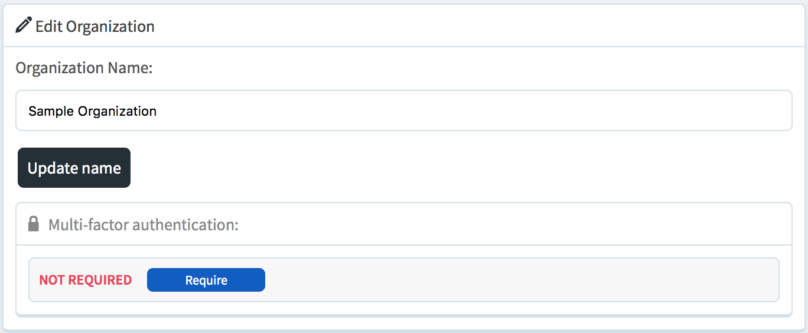

# Enabling Multi-Factor Authentication

Enabling multi-factor authentication (MFA) is a straightforward process that adds another layer of security to your Catalyze account. To start, head to [https://product.catalyze.io/account/mfa/activate](https://product.catalyze.io/account/mfa/activate).

Here you'll be prompted for your username and password as well as which type of MFA you would like to enable. Catalyze currently supports two modes for generating One-Time Passwords (OTP): email and authenticator apps such as Google Authenticator. Type in your credentials and choose `Email`.



Once you click `Activate`, you will receive an OTP at the email address associated with your account. This code may take a minute or two to arrive. Once you receive your OTP, enter it at the displayed prompt.



For now, leave the `Set as preferred` checkbox checked. This is explained in the [Preferred Mode](#preferred-mode) section below. After entering the OTP and clicking `Complete MFA Activation` you will be shown a success notification.



You can now login with MFA!

# Entering a One-Time Password (OTP)

After successfully enabling MFA, you will be prompted to enter an OTP on subsequent logins. Head to the [dashboard](https://product.catalyze.io/account) to login. Enter your credentials and `Submit`.

You will be shown an area to enter your OTP along with the method of delivery so that you know exactly where to look.



Enter your OTP and click `Submit`. You've now successfully logged in with MFA enabled!

# The CLI and MFA

Since version 3.6.0, the [CLI](https://github.com/catalyzeio/cli) fully supports MFA enabled accounts. The CLI will prompt you for your credentials every time your session token expires. When this occurs, you will be prompted for your username and password as well as an OTP if MFA is enabled. You'll just need to enter the OTP received through email or generated through an authenticator app to complete the signin process.

```
$ catalyze environments
Username or Email: example@catalyze.io
Password:
This account has two-factor authentication enabled.
Your one-time password (sent to your email):
```

# Adding Additional Factors

Adding one factor is all that is required to enable MFA for your Catalyze account. However, we recommend enabling multiple factors in the event that access to a mobile device or email address is lost. This can be done by logging into the [dashboard](https://product.catalyze.io/account) and navigating to [your account settings](https://product.catalyze.io/account/view). From there, you can enable another factor, disable any number of factors, or change your [preferred mode](#preferred-mode) by expanding the MFA section.

To enable the authenticator mode, click `Enable` and confirm the prompt.



You'll be shown a screen to enter your credentials with the `authenticator` option already chosen.



Enter your credentials and submit. You will then be shown a QR code to scan with an authenticator app. Open your app, scan the QR code, and enter one of the OTPs generated.



Submitting this form will successfully enable your second form of MFA.

# Preferred Mode

When multiple factors are enabled for your Catalyze account, only one of them is set as the preferred mode. When logging into a Catalyze product with MFA enabled, your preferred mode will be used to send an OTP (if applicable). When you login to the [dashboard](https://product.catalyze.io/account), you will be given the option to change the method that is being used only for that login attempt.



However, the CLI does not support switching the mode used for a given login attempt and will always use your preferred mode. You can change your preferred mode by navigating to [your account settings](https://product.catalyze.io/account/view) and clicking the `Make Preferred` button next to the mode you wish to be preferred.


# MFA is Optional

Although MFA is optional, it is recommended to enhance the security of your Catalyze account.

# Organization Enforcement

Although MFA is optional, organization owners are given the ability to require all members of their organization to have MFA enabled. To turn on this feature, as an organization owner login to the [dashboard](https://product.catalyze.io/account). After logging in, hover over `Organizations` and click on the organization for which you want to enforce MFA.



Then you can click on `Require` to start enforcing MFA for all members of that organization.



# Troubleshooting

Having trouble getting MFA enabled? Check out our [troubleshooting guide](/stratum/articles/mfa-troubleshooting) for help!
