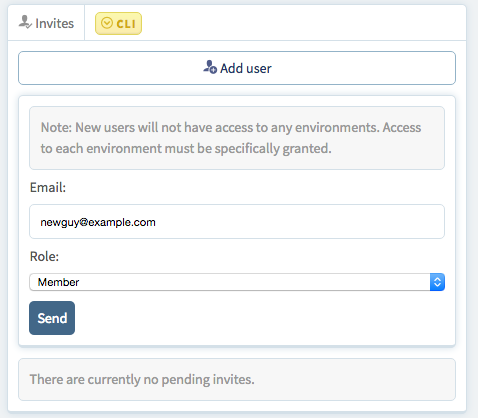
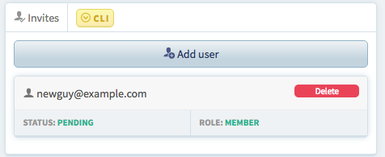

# Managing Your Organization

After completing the paperwork for your first environment, Catalyze will create an organization for you in the [Stratum Dashboard](https://stratum.catalyze.io) and invite the contract holder to the organization. From there, you will be free to manage access to your organization and environments.

## Organization Roles (Draft, needs permanent data)

Organizations have three levels of roles:

- ***Member*** (Role available early March 2016)
  - Belong to the organization but must be given access to specific environments
  - Cannot manage other users
- ***Admin***
  - Has full access to all environments and can manage member-level users
  - Can invite users and manage their environment access settings
- ***Owner***
  - Full access to environments and user management
  - Assigned ownership of organization
  - Cannot be removed or modified by other users
  - The first account in each organization is an owner account

|Permission|Member|Admin|Owner|
|---|---|---|---|
|  List Users of Org |x  |x  |x  |
| Invite Users to Org | | x  |x   |
| Add/Remove Admins  |   |   |x   |
| Access Authorized Environments |x |   |   |
| Access All Environments  |   |  x|x   |
| Give Members Access to an Environment  |   | x  |  x |

## Adding Users to an Organization

Adding users to an organization is managed through an invitation process controlled via the dashboard.

Log into the [Stratum Dashboard](https://stratum.catalyze.io) with an admin or owner account for the organization that you want to manage.

At the top of the screen, mouse over the `Organizations` button and select the organization to manage.

Clicking on the organization brings up the overview display for the organization. On the right side of the screen is the `Invites` panel. To invite someone to an organization, click the `Add User` button. Then, type in their e-mail address, select a role for them, and invite them.

Their invitation will be listed as pending below the invite box until the user accepts the invitation.

Once the user accepts the invitation, they will show up in the organization user list and an admin or owner can authorize their environment access.

## Environment access (Available early March 2016)

Currently, environment access is an all or nothing permission in the organization. If an admin or owner gives a member access to an environment, the member has permission to:

- View monitoring UI
- View logging UI
- Push Code to Environment Repositories
- Use all CLI commands related to environments
