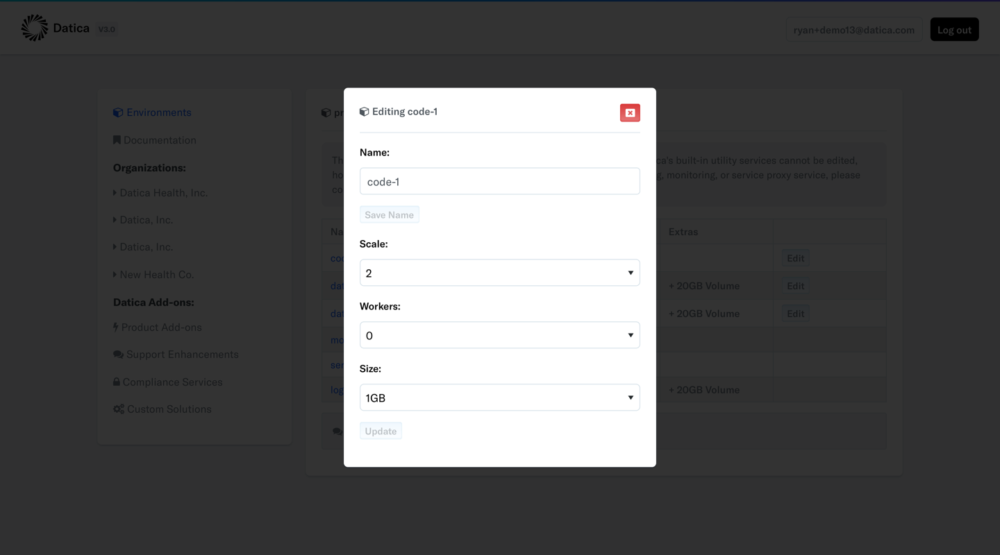

# How can I scale with Datica and The Platform?
As of August 15th, 2017 Datica provides new customers on the Developer and Growth plans the ability to scale services at will. To scale a services, navigate to your Platform dashboard. In the environments listing find the environment that contains the service you're looking to scale. From there click the "Edit" button next to the environment name. This will take you to the environment details view. Here you will see an "Edit" button along side the services that you're able to scale. See the image below for an example:

When you find the service you want to scale click the aforementioned "Edit" button. You should see a modal like this:

Inside of this modal you'll have several options. You can...

- Rename the service
- Scale the service up and down
- Add workers (for code services)
- Resize the ram

At this time we do not offer Database service scaling, however we are working on providing this functionality. In the meantime please reach out to Datica support.

**Note for customers on contracts created before August 15th 2017:** If you're a customer on an older Datica contract you may not have access to these self-service scaling features. To update your contract please contact [upgrade@datica.com](mailto:upgrade@datica.com). Thanks!

